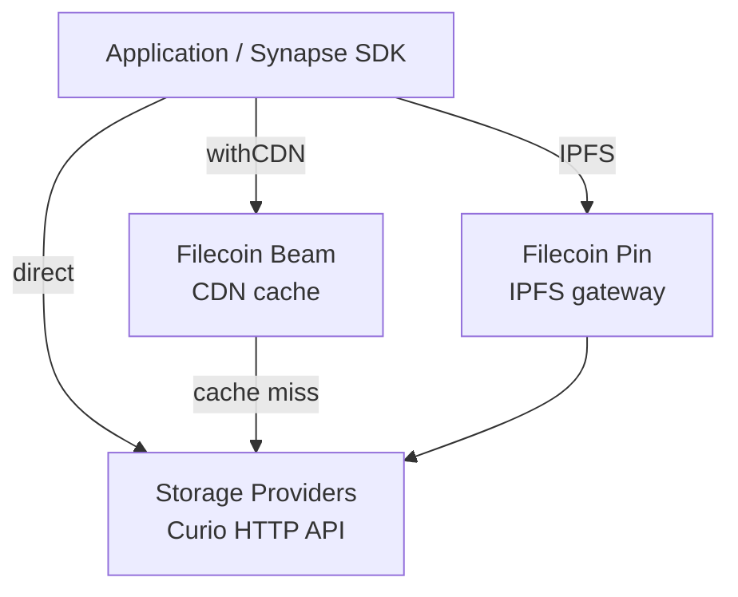

Storing data is only half of a cloud platform. Applications also need to read it back quickly and reliably. The **Filecoin Onchain Cloud (FOC)** is built for a "store and serve" model, where every piece you store stays retrievable over HTTP for the life of its data set.

This page explains how retrieval works in FOC and the paths available to you.

## Content Addressing

Every piece in FOC is identified by a **PieceCID**, a content-addressed identifier derived from the data itself. A PieceCID does not point at a location. It points at the content.

This has two practical consequences for retrieval:

- **Location independence.** The same PieceCID can be served by any provider that holds the piece, or by a CDN sitting in front of those providers. Retrieval can route around a slow or offline provider without changing the address.
- **Verifiable downloads.** Because the identifier is derived from the bytes, a client can recompute the PieceCID of whatever it receives and confirm it matches what was requested. The Synapse SDK does this automatically on every download, so tampered or corrupted responses are rejected before they reach your application.

## Retrieval Paths

FOC offers three ways to retrieve a piece. They share the same PieceCID and can be mixed within a single application.

| Path | Source | Latency | When to use |
| ----- | ------- | ------- | ----------- |
| **Direct SP retrieval** | Storage provider HTTP API | Seconds | Default. No extra setup or egress charges. |
| **FilBeam (CDN) retrieval** | Filecoin Beam cache, backed by SPs | Milliseconds | Hot data, frequent reads, latency-sensitive apps. |
| **IPFS retrieval** | IPFS network via Filecoin Pin | Varies | IPFS-native applications and gateways. |



## Direct SP Retrieval

The default path serves data straight from the storage providers that hold it. Each provider runs a Curio node that exposes an HTTP API, and pieces are fetched directly from that endpoint.

Because data is content-addressed, retrieval does not require you to know which provider holds a given piece. The SDK resolves a serving URL for you:

1. It reads your data sets on chain to find which providers store the piece.
2. It probes those providers in parallel and selects one that confirms it has the piece.
3. It downloads from that provider and validates the bytes against the PieceCID.

This makes downloads **SP-agnostic**. If a piece lives on more than one provider, retrieval succeeds as long as any one of them is reachable.

Direct retrieval has no egress charges. It is the right default for most workloads, with latency in the range of seconds.

## FilBeam (CDN) Retrieval

[**Filecoin Beam**](https://docs.filbeam.com/) is the retrieval and delivery layer of FOC. It is a content delivery network that caches pieces close to where they are requested, cutting retrieval latency from seconds to milliseconds.

FilBeam serves each piece from a per-account subdomain keyed by your wallet address, with the PieceCID in the path. On mainnet:

```text
https://<your-address>.filbeam.io/<pieceCid>
```

On calibration the host is `<your-address>.calibration.filbeam.io`. The SDK builds this URL for you, so you rarely construct it by hand.

Retrieval through FilBeam follows one of two paths:

- **Cache hit.** The piece is already in the FilBeam cache and is served directly. This is the fast path.
- **Cache miss.** The piece is not yet cached. FilBeam retrieves it from a storage provider, serves it to the client, and warms the cache so later reads are hits.

Both paths are metered. FilBeam tracks egress per data set and bills it based on volume, separately from the base storage cost, with cache misses priced higher than cache hits. See the [FilBeam pricing reference](https://docs.filbeam.com/how-it-works/pricing/) for current rates.

You can inspect the remaining egress quotas for a data set through the SDK:

```ts twoslash
// @lib: esnext,dom
import { Synapse } from "@filoz/synapse-sdk"
import { privateKeyToAccount } from "viem/accounts"

const synapse = await Synapse.create({ account: privateKeyToAccount("0x..."), source: "my-app" })
// ---cut---
const stats = await synapse.filbeam.getDataSetStats(12345)
console.log("Remaining CDN egress (cache hits):", stats.cdnEgressQuota)
console.log("Remaining cache-miss egress:", stats.cacheMissEgressQuota)
```

For dashboards and other ways to track consumption, see the FilBeam [monitor usage guide](https://docs.filbeam.com/how-to-guides/monitor-usage/).

FilBeam delivery is opt-in per data set. Storing with the `withCDN` option marks a data set as CDN-enabled, which keeps CDN and non-CDN data sets separate and routes downloads through FilBeam when requested.

## IPFS Retrieval

For applications that speak IPFS natively, content stored through [**Filecoin Pin**](/core-concepts/filecoin-pin/) is also served over the IPFS network. Filecoin Pin packs your data into an IPFS CAR, stores it on FOC providers, and announces it to IPNI, so it resolves through standard IPFS gateways by its root CID:

```text
https://dweb.link/ipfs/<your-root-cid>
```

This path lets IPFS-native apps treat FOC as a durable, verifiable backing store while keeping the addressing and access patterns their stack already uses. See the [Filecoin Pin quick start](/getting-started/filecoin-pin/) to pin and retrieve your first file.

## Retrieving with the SDK

The Synapse SDK exposes all of these paths through a single `download` method. Without `withCDN` it resolves a storage provider that holds the piece and downloads from it; setting `withCDN` adds the FilBeam URL to the sources it races. Either way, the returned bytes are validated against the requested PieceCID before they reach your application.

For usage, code examples, CDN options, and provider-scoped reads, see [Retrieval in the Storage Operations guide](/developer-guides/storage/storage-operations/#retrieval).

## Summary

- Pieces are content-addressed by PieceCID, so retrieval is location-independent and verifiable.
- **Direct SP retrieval** is the default. It is SP-agnostic and has no egress charges.
- **FilBeam** adds a CDN layer for millisecond latency, billed on egress per data set.
- **IPFS retrieval** via Filecoin Pin serves the same content to IPFS-native applications.

## Next Steps

- [Storage Operations](/developer-guides/storage/storage-operations/) - Upload and download with the SDK
- [Filecoin Warm Storage Service](/core-concepts/fwss-overview/) - The service layer behind storage and retrieval
- [Filecoin Pin](/core-concepts/filecoin-pin/) - Guaranteed IPFS pinning backed by FOC
- [FilBeam Documentation](https://docs.filbeam.com/) - CDN delivery and egress pricing
