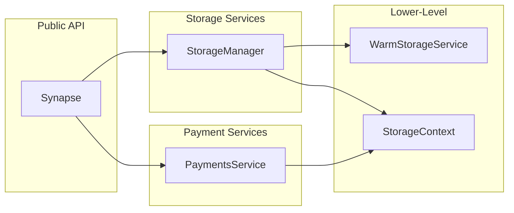
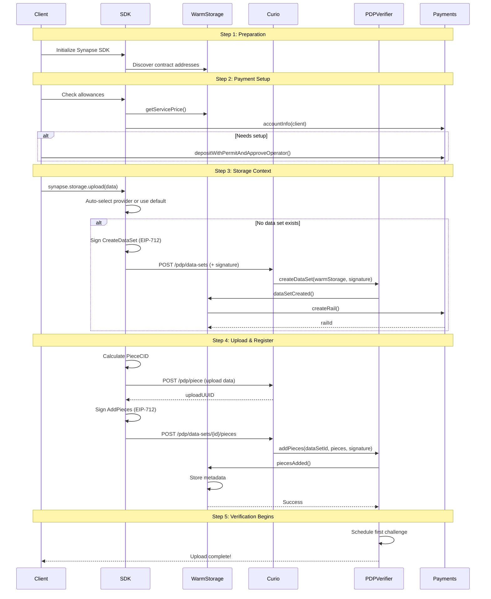

This page describes the components of the Synapse SDK and how they work together. You'll learn how each component can be used independently, how they are organized within the SDK architecture, and how they interact with the underlying smart contracts and storage providers.

The SDK is built from these core components:

- **`Synapse`** - Main SDK entry point with simple, high-level API
- **`PaymentsService`** - SDK client for managing deposits, approvals, and payment rails (interacts with Filecoin Pay contract)
- **`StorageManager`**, **`StorageContext`** - Storage operation classes
- **`WarmStorageService`** - SDK client for storage coordination and pricing (interacts with WarmStorage contract)

The following diagram illustrates how these components relate to each other and the external systems they interact with:

The SDK architecture is guided by several key principles that ensure maintainability, flexibility, and ease of use:

**Design Principles**:

- **Separation of Concerns**: Protocol, business logic, and application layers are distinct
- **Composability**: Each component can be used independently or together
- **Abstraction**: SDK hides blockchain complexity from applications
- **Verification**: All storage backed by cryptographic proofs

## SDK Components

The SDK is organized into three layers, each serving a specific purpose:

- **High-Level API**: The `Synapse` class provides a simple interface for common operations.
- **Service Layer**: `PaymentsService` and `StorageManager` handle domain-specific logic.
- **Lower-Level Clients**: Direct access to contracts and providers for advanced use cases.

### Synapse

**Purpose**: Main SDK entry point with simple, high-level API

**API Reference**: [Synapse API Reference](/reference/filoz/synapse-sdk/synapse/classes/synapse/)

### PaymentsService

The PaymentsService provides direct access to the Filecoin Pay contract, enabling you to:

- Manage token deposits and withdrawals
- Approve operators for automated payments
- Query and settle payment rails
- Monitor account health and balance

This is your primary interface for all payment-related operations in the SDK.

**API Reference**: [PaymentsService API Reference](/reference/filoz/synapse-sdk/payments/classes/paymentsservice/)

Check out the [Payment Operations](/developer-guides/payments/payment-operations/) guide for more details.

### StorageManager

**Purpose**: High-level, auto-managed storage operations - upload and download data to and from the Filecoin Onchain Cloud.

**API Reference**: [StorageManager API Reference](/reference/filoz/synapse-sdk/storage/classes/storagemanager/)

Check out the [Storage Operations](/developer-guides/storage/storage-operations/) guide for more details.

### StorageContext

**Purpose**: Provider-specific storage operations - upload and download data to and from the Filecoin Onchain Cloud.

**API Reference**: [StorageContext API Reference](/reference/filoz/synapse-sdk/storage/classes/storagecontext/)

Check out the [Storage Context](/developer-guides/storage/storage-context/) guide for more details.

### WarmStorageService

**Purpose**: SDK client for storage coordination and pricing - storage pricing and cost calculations, data set management and queries, metadata operations (data sets and pieces), service provider approval management, contract address discovery, data set creation verification.

**API Reference**: [WarmStorageService API Reference](/reference/filoz/synapse-sdk/warmstorage/classes/warmstorageservice/)

## Complete Data Flow

This sequence diagram shows the complete lifecycle of a file upload operation, from initialization through verification. Each step represents an actual blockchain transaction or API call.

## Next Steps

Choose your learning path based on your immediate needs:

### Ready to Build?

Jump straight to code with the [**Getting Started Guide →**](/getting-started/)

- [**Storage Operations →**](/developer-guides/storage/storage-operations/) - Upload and download your first file
- [**Storage Context →**](/developer-guides/storage/storage-context/) - Advanced storage operations and batch uploads
- [**Payment Operations →**](/developer-guides/payments/payment-operations/) - Fund your account and manage payments
- [**Rails & Settlement →**](/developer-guides/payments/rails-settlement/) - Payment mechanics and settlement strategies

### Want to Learn More?

- [**Architecture →**](/core-concepts/architecture/) - Understanding how all components work together
- [**PDP Overview →**](/core-concepts/pdp-overview/) - Proof verification and data integrity
- [**Filecoin Pay →**](/core-concepts/filecoin-pay-overview/) - Payment rails and lockup mechanisms
- [**Warm Storage Service →**](/core-concepts/fwss-overview/) - Storage coordination and pricing model
