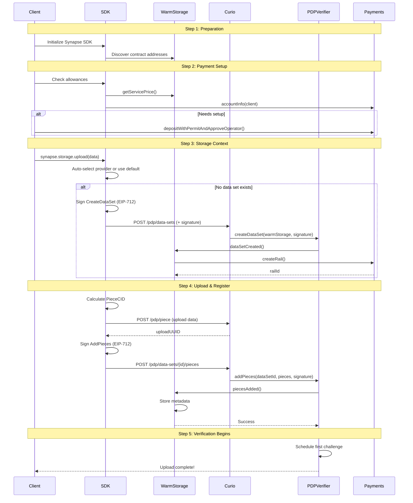

This page describes the available Synapse packages and how to choose the one that fits your use case.

## Packages

| Package | Best For |
|---------|----------|
| **[Synapse SDK](/developer-guides/synapse/)** | CLI tools, scripts, Node.js backends |
| **[Synapse Core](/developer-guides/synapse-core/)** | Fine-grained control, custom integrations |
| **[Synapse React](/developer-guides/react-integration/)** | React applications |

The packages form three layers:

1. **Core** - Composable modules for each filecoin onchain cloud operation. Both the SDK and React packages build on Core.
2. **SDK** - Wraps Core into a single `Synapse` entry point that manages payments, storage, and provider discovery.
3. **React** - Wraps Core into React hooks.

## Synapse SDK

**Synapse SDK** is the recommended starting point. A single `Synapse` class coordinates payments, storage, provider discovery, and session keys behind a high-level API.

- **Payments**: Deposits, withdrawals, operator approvals ([Payments Operations Guide →](/developer-guides/payments/payment-operations/))
- **Storage**: Upload and download files to storage providers ([Storage Operations Guide →](/developer-guides/storage/storage-operations/))
- **Provider Discovery**: Query registered storage providers and products
- **Session Keys**: Delegate signing authority for automated workflows

[**Synapse SDK Guide →**](/developer-guides/synapse/)

[**Synapse SDK Reference →**](/reference/filoz/synapse-sdk/toc/)

## Synapse Core

**Synapse Core** is a low-level building blocks that the SDK and React packages build on. Use when you need direct control over individual operations.

- **Contract functions** - Filecoin Pay, Warm Storage, PDP Verifier, Service Provider Registry
- **Storage provider HTTP API**: Data set creation, piece uploads, deletions
- **PieceCID utilities** - Calculate, parse, and validate piece identifiers
- **EIP-712 typed data** - Sign operations for data set and piece management
- **Chain configuration** - Mainnet, calibration, and devnet definitions

[**Synapse Core Guide →**](/developer-guides/synapse-core/)

[**Synapse Core Reference →**](/reference/filoz/synapse-core/toc/)

## Synapse React

React hooks for payments, storage, and provider operations. Built on [Wagmi](https://wagmi.sh) and [TanStack Query](https://tanstack.com/query).

[**Synapse React Guide →**](/developer-guides/react-integration/)

[**Synapse React Reference →**](/reference/filoz/synapse-react/toc/)

## Complete Data Flow

The sequence below shows the complete lifecycle of a file upload — from initialization through on-chain verification.

```mermaid
sequenceDiagram
    participant Client
    participant SDK
    participant WarmStorage
    participant Curio
    participant PDPVerifier
    participant Payments

    Note over Client,Payments: Step 1: Preparation
    Client->>SDK: Initialize Synapse SDK
    SDK->>WarmStorage: Discover contract addresses

    Note over Client,Payments: Step 2: Payment Setup
    Client->>SDK: Check allowances
    SDK->>WarmStorage: getServicePrice()
    SDK->>Payments: accountInfo(client)
    alt Needs setup
        Client->>Payments: depositWithPermitAndApproveOperator()
    end

    Note over Client,Payments: Step 3: Storage Context
    Client->>SDK: synapse.storage.upload(data)
    SDK->>SDK: Auto-select provider or use default
    alt No data set exists
        SDK->>SDK: Sign CreateDataSet (EIP-712)
        SDK->>Curio: POST /pdp/data-sets (+ signature)
        Curio->>PDPVerifier: createDataSet(warmStorage, signature)
        PDPVerifier->>WarmStorage: dataSetCreated()
        WarmStorage->>Payments: createRail()
        Payments-->>WarmStorage: railId
    end

    Note over Client,Payments: Step 4: Upload & Register
    SDK->>SDK: Calculate PieceCID
    SDK->>Curio: POST /pdp/piece (upload data)
    Curio-->>SDK: uploadUUID
    SDK->>SDK: Sign AddPieces (EIP-712)
    SDK->>Curio: POST /pdp/data-sets/{id}/pieces
    Curio->>PDPVerifier: addPieces(dataSetId, pieces, signature)
    PDPVerifier->>WarmStorage: piecesAdded()
    WarmStorage->>WarmStorage: Store metadata
    WarmStorage-->>PDPVerifier: Success

    Note over Client,Payments: Step 5: Verification Begins
    PDPVerifier->>PDPVerifier: Schedule first challenge
    PDPVerifier-->>Client: Upload complete!
```

## Next Steps

Choose your learning path based on your immediate needs:

#### Ready to Build?

Jump straight to code with the [**Getting Started Guide →**](/getting-started/)

- [**Storage Operations →**](/developer-guides/storage/storage-operations/) - Upload and download your first file
- [**Storage Context →**](/developer-guides/storage/storage-context/) - Advanced storage operations and batch uploads
- [**Payment Operations →**](/developer-guides/payments/payment-operations/) - Fund your account and manage payments
- [**Rails & Settlement →**](/developer-guides/payments/rails-settlement/) - Payment mechanics and settlement strategies
- [**React Integration →**](/developer-guides/react-integration/) - Use Synapse React hooks in your React app

#### Want to Learn More?

- [**Architecture →**](/core-concepts/architecture/) - Understanding how all components work together
- [**PDP Overview →**](/core-concepts/pdp-overview/) - Proof verification and data integrity
- [**Filecoin Pay →**](/core-concepts/filecoin-pay-overview/) - Payment rails and lockup mechanisms
- [**Warm Storage Service →**](/core-concepts/fwss-overview/) - Storage coordination and pricing model
