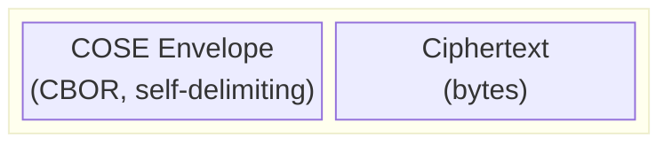
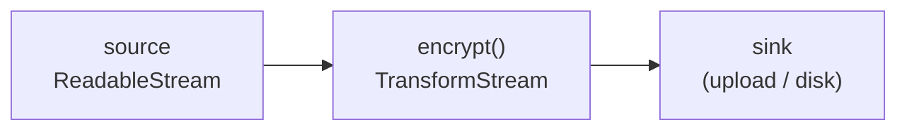

# Filecoin Encryption Envelope — technical specification

Implementation of [FIP #1253](https://github.com/filecoin-project/FIPs/discussions/1253): a COSE
container pairing a self-describing metadata envelope with detached ciphertext.

Status: draft. Nothing is published; the wire profile below is not yet frozen.

## Scope

| Owns | Does not own |
| --- | --- |
| Envelope format, encode and decode | Where the CEK came from |
| Encryption and decryption, both schemes | Application CEK derivation trees, salts, passwords |
| Chunk layout and positional nonce derivation | Datasets, wallets, on-chain state |
| AEAD and AAD construction | Storage, retrieval, HTTP |
| Key wrapping to recipients | Recipient key discovery |
| Authenticated range decryption | Any UX |

The library accepts a caller-supplied 32-byte content encryption key (CEK). It validates the key's
length and rejects an all-zero value, but does not generate or derive the CEK, inspect its origin,
or track its use across encryption attempts. Key secrecy and reuse management belong to the caller;
see [CEK responsibilities](#cek-responsibilities).

Application CEK derivation is outside this package. A KDF used by a recipient key-agreement
algorithm would be inside it, producing a key-encryption key (KEK) that wraps the supplied CEK —
but no such algorithm is supported yet; see [Algorithms](#algorithms) on the deferred `-31`
profile.

Application metadata is **semantically** opaque: we carry it, authenticate it, and never interpret
what it means. Its CBOR structure is not opaque — the library validates shape, permitted value
types, key types, nesting depth and cycles against an allowlist, and rejects anything outside it.
See [`app_metadata`: current library restrictions](#app_metadata-current-library-restrictions).

## Blob layout



CBOR is self-delimiting, so a reader decodes the envelope off the front of the stream and every
remaining byte is ciphertext. No length prefix, no framing. For the chunked scheme the ciphertext
is fixed-stride, which is what makes range reads arithmetic rather than an index lookup:

```
one chunk on the wire = [ ciphertext (chunk_size bytes) ‖ tag (16 bytes) ]

[chunk₀][chunk₁][chunk₂] … [chunkₙ]
                            └─ the only one that may be short.
                               Full when the plaintext is an exact
                               multiple of chunk_size; 16 bytes
                               (tag only) when the plaintext is empty.
```

Every chunk occupies exactly `chunk_size + 16` bytes except the last, which may be shorter, so
chunk `i` begins at `envelope_len + i × (chunk_size + 16)`.

## Wire profile

This profile follows FIP-1253 **plus the changes proposed in
[`filecoin-encryption-envelope-fip-amendments.md`](./filecoin-encryption-envelope-fip-amendments.md)**,
adopting all of them.

Those amendments have been reviewed by the FIP author but are **not yet adopted into the FIP**, so
everything here that follows them is a *library profile decision*, not a published rule. Where this
document and the FIP text disagree, the amendments document explains which of the two we follow and
why.

### Protected header

Serialised as a byte string and fed into the AEAD, so every field here is authenticated by every
chunk tag.

| Label | Name | Type | Required | Notes |
| --- | --- | --- | --- | --- |
| 1 | `alg` | int | yes | `3` or `-65793` |
| 16 | `typ` | tstr | yes | `application/vnd.filecoin-encryption+cose` |
| 3 | `content_type` | tstr / uint | no | media type; a numeric value MUST be a non-negative safe integer |
| 5 | `iv` | bstr | yes | 12 bytes (scheme 1) or 7-byte base nonce (chunked) |
| -1 | `chunk_size` | uint | chunked only | plaintext bytes per chunk |
| -65789 | `plaintext_length` | uint | no | chunked only; exact plaintext byte count, see below |
| -65792 | `app_metadata` | map | no | string-keyed, opaque to this library |

`iv` (label 5) MUST appear here and MUST NOT appear in the unprotected map. COSE permits either
placement, and an earlier draft of this profile claimed the IV *had* to be unprotected because a
decryptor needs it before it can verify anything. That reasoning was wrong: protected headers are
plaintext on the wire, so a decryptor reads the IV out of them just as easily. Placing it here folds the IV into the serialized protected bytes and
therefore into the content AAD.

### Unprotected header

Not covered by the AEAD. **The v1 encoder emits no content unprotected parameters**, so the map it
writes is empty — which is a statement about the encoder, not a closed door: decoders accept
unknown non-critical parameters here, as described under COSE processing below.

### CDDL

```cddl
; Outer structures only. Field-level rules live in the header table and the
; COSE processing notes below — a closed CDDL map would contradict the
; extension policy, since decoders accept unknown non-critical parameters.

Filecoin-Encryption-Envelope = COSE_Encrypt0_Tagged / COSE_Encrypt_Tagged

COSE_Encrypt0_Tagged = #6.16([ protected: bstr .cbor header_map,
                               unprotected: header_map,
                               ciphertext: nil ])
COSE_Encrypt_Tagged  = #6.96([ protected: bstr .cbor header_map,
                               unprotected: header_map,
                               ciphertext: nil,
                               recipients: [+ COSE_recipient] ])

COSE_recipient = [ protected: empty_or_serialized_map, unprotected: header_map, ciphertext: bstr ]

header_map = { * (int / tstr) => any }

; RFC 9052 §3: a protected field is either a serialized map or a zero-length
; byte string. A256KW requires the latter — see Recipients below.
empty_or_serialized_map = bstr .cbor header_map / bstr .size 0
```

**COSE processing** follows amendment 5 and RFC 9052; this document does not restate it. In
outline: received protected bytes are preserved verbatim for all cryptographic processing and never
re-encoded, `crit` is processed rather than ignored, duplicate header labels and malformed protected
maps are rejected, and map-key order is not significant. Two encoding decisions this profile makes
explicitly, because leaving them to whichever parser is chosen would change interoperability:
**indefinite-length CBOR is rejected**, and so are **non-minimal integer encodings** — a value
encoded in more bytes than it needs. Both are rejected on decode, not merely avoided on encode.

Unknown **non-critical** parameters are accepted and ignored after their CBOR passes this library's
parser rules. Version 1 rejects CBOR floats anywhere in an envelope, including inside an unknown
parameter. A parameter named by `crit` that this profile does not understand is rejected, and
`crit` itself must be protected.

**Recipients.** Tag 16 carries no recipient structure at all; tag 96 carries one or more, and its
recipients array MUST NOT be empty — a caller passing `recipients: []` is an error, not a request
for tag 16, since the two express different intents and silently reinterpreting one as the other
hides a mistake. Nested recipient layers are outside this profile.

Only A256KW (`-5`) is supported; see [Algorithms](#algorithms) on the deferred `-31`
profile. For A256KW the recipient's protected field is `h''` (zero-length, *not* an encoded empty
map — the two differ by one byte and are commonly confused), `alg = -5` lives in the unprotected
map, and `kid` (label 4, a byte string) is recommended wherever a decryptor may hold more than one
key, since without it the only way to find the right recipient is to attempt every unwrap.

### `app_metadata`: current library restrictions

`app_metadata` is **semantically** opaque — the library carries and authenticates it and never
interprets what it means — but its structure is not. Every value inside it, at any depth, is checked
against an **allowlist**: a well-formed Unicode string, a safe integer, a boolean, `null`, a
`Uint8Array`, a dense array of those, a `Map` with scalar keys (string, safe integer, or byte
string) and no two keys equal by content, or a plain object with string keys. Anything else is
rejected — `undefined`, `bigint`, symbols, functions, `Date` and other class instances, sparse
arrays, compound map keys, and whatever nobody has thought of yet. Nesting is capped at 256 levels
and cycles are rejected, both with package errors rather than a stack overflow. The exact rules and
their edge cases live in `src/cose/headers.ts` and its tests, which state them more precisely than
prose can.

**These are library restrictions, not COSE requirements and not adopted FIP rules.** Two of them
have a reason worth keeping out of the code, because a future reader is otherwise likely to relax
them:

- **Numbers are integers only, for now.** Every non-integer would have to travel as a CBOR float,
  and this profile's decoder rejects CBOR floats outright. That rejection is a consequence of the
  current decoder design rather than anything FEE or COSE requires: a float `3.0` and an integer `3`
  decode to the same JavaScript number, so a float encoding could otherwise shadow an
  integer-valued header such as `alg`. Lifting this is tracked under [Deferred
  work](#deferred-work).
- **The allowlist is deliberately an allowlist.** Naming what is permitted, rather than what is
  forbidden, is what makes a shape nobody anticipated a rejection rather than a gap.

Both rules are enforced on **encode and decode alike**, from one shared validator. Splitting them
across two code paths is what let the encoder drift into emitting values its own decoder refused.

### Algorithms

FEE uses the COSE `alg` label at two separate layers:

- The **content layer** says how the CEK encrypts the plaintext.
- A **recipient layer** says how an intended decryptor can recover that CEK.

The plaintext is encrypted once. When recipients are present, the same CEK may be wrapped in
different ways for different keys. A recipient record is one such way to recover the CEK; it may
represent a person, device, service, or shared key rather than a person directly.

```text
plaintext + CEK               -- content alg -->   ciphertext
CEK + recipient key material  -- recipient alg --> wrapped CEK in a recipient record
```

#### Content encryption

| `alg` | FEE scheme | Operation | Seekable |
| --- | --- | --- | --- |
| `3` | Scheme 1 | AES-256-GCM encrypts the whole plaintext in one operation | no |
| `-65793` | Scheme 2 | Chunked AES-256-GCM with STREAM encrypts each chunk separately | yes |

Scheme 1 must be selected explicitly through the one-shot `encryptAesGcm` API. Choosing it forfeits
streaming and range decryption, so it is never a default and never inferred.

#### Recipient key distribution

Recipient algorithms do not encrypt the plaintext. They protect a wrapped copy of the CEK in a
recipient record:

| `alg` | Operation | Library support |
| --- | --- | --- |
| `-5` | A256KW wraps the CEK with a previously shared 256-bit key-encryption key (KEK) | supported |
| `-31` | ECDH-ES+A256KW derives a KEK through elliptic-curve key agreement, then wraps the CEK with A256KW | deferred |

With A256KW (`-5`), the sender and recipient already have the same KEK. The sender wraps the CEK,
and a recipient holding that KEK can unwrap it. A256KW is the only recipient algorithm this version
can use to recover a CEK.

A `COSE_Encrypt` envelope may contain recipients using different algorithms. The library MUST skip a **well-formed** recipient whose algorithm it does not support and continue looking for a supported one; a recipient that is not a well-formed `COSE_recipient` is rejected rather than skipped. Decryption fails if no supported recipient can provide the CEK.

**`-31` (ECDH-ES+A256KW) is deferred.** Supporting it requires more than the algorithm identifier and wrapped key. The profile must also define the curve, public-key encoding and validation, ephemeral-key requirements, salt and party information, and the remaining `COSE_KDF_Context` inputs. Without these rules, implementations may derive different KEKs and fail to unwrap the CEK.

Note the relevant reference for `-31` is RFC 9053 §6.4 (key agreement **with** key wrap), not §6.3
(direct key agreement) — a distinction to get right when that profile is written.

### Nonce generation

For each new whole-object encryption invocation, the library MUST generate a fresh random IV using
`crypto.getRandomValues`: 12 bytes for scheme 1, or a 7-byte base nonce for the chunked scheme.
The encryption API MUST NOT accept a caller-supplied IV or base nonce. Failure to obtain randomness
MUST fail encryption; there is no deterministic fallback.

All chunks within one invocation share the supplied CEK and base nonce. The library derives a
different full nonce for each chunk as shown below. Decryption uses the IV stored in the envelope.
Retransmitting existing encrypted bytes is not a new encryption invocation and draws no new nonce.

**Why callers cannot override the nonce.** This profile requires a fresh CEK for every encryption,
but the library cannot tell whether a caller has reused one. It therefore generates the nonce too.
Allowing both values to come from the caller could repeat a key/nonce pair, breaking confidentiality
and integrity.

### Per-chunk nonce

```
nonce (12) = base_nonce (7) ‖ chunk_index (4, big-endian) ‖ last_flag (1)
last_flag  = 0x01 on the final chunk, 0x00 otherwise
```

Every chunk uses the *same* AAD, the envelope-level `Enc_structure`. The nonce is the only thing
binding a chunk to its position, which is what detects reordering, insertion and truncation.
Scheme 2 makes one random base-nonce choice for the object. Its chunks are not separate random
nonce choices; the index and final flag deterministically give each chunk a distinct 12-byte
AES-GCM nonce.

### AAD

```cddl
Enc_structure = [ context: "Encrypt0" / "Encrypt", protected: bstr, external_aad: bstr ]
```

Context is `"Encrypt"` for tag 96 and `"Encrypt0"` for tag 16, derived from the envelope tag
rather than from recipient presence. `external_aad` is always empty.

### `plaintext_length` and truncation

`plaintext_length` (label `-65789`, protected, chunked scheme only) is the exact number of plaintext
bytes. It is optional: the encoder writes it when the caller supplies `contentLength`, and omits it
for a stream whose length is not known before the envelope is emitted.

**Chunk layout** means how the ciphertext is divided: how many chunks, how long the last one is, and
the total plaintext size. A reader needs all of it before decrypting anything, because a chunk's
nonce includes the last-chunk flag. Two numbers already give the lot — the blob size and the chunk
size.

```
ciphertext_size = blob_size − envelope_len
stride          = chunk_size + 16

chunk_count     = ceil(ciphertext_size / stride)
last_chunk_len  = ciphertext_size − (chunk_count − 1) × stride
plaintext_size  = (chunk_count − 1) × chunk_size + (last_chunk_len − 16)
```

So a stored length is redundant *for decoding*, which is why the FIP says not to store a count. It
is not redundant for **verifying**, and that is the point: every input to the derivation above comes
from the same untrusted place as the bytes. An authenticated length turns "trust the reported blob
size" into "check it against a value a CEK holder committed to."

#### Why a length and not a count

An earlier draft stored an authenticated `chunk_count` instead. A count commits only to how many
chunks there are, so it detects truncation **only when the chunk count changes**. Remove 32 bytes
from a 100-byte final chunk and the derived count is unchanged, the declared count still matches,
and a range read over an earlier chunk authenticates cleanly. A length has no such blind spot: any
byte added or removed changes the expected total.

#### Encoding

With `P = plaintext_length` and `S = chunk_size`:

```
N = max(1, ceil(P / S))     ← the max matters: ceil(0 / S) is 0, and empty input is one chunk
C = P + 16 × N              ← expected detached ciphertext length
```

When the caller supplies `contentLength`, the encoder knows `P` before writing the envelope. It
checks that `P` is a non-negative safe integer, that `N` is within the format range of
1 … 2³² − 1, and that `C` is a safe integer. It then **counts the plaintext bytes it actually
consumes** and fails if the total differs from the declared `P`. When the length is not known before
the envelope is written, the caller omits `contentLength` and the encoder omits `plaintext_length`.

The timing is better than "check at the end" suggests, because the encoder already holds one chunk
of lookahead: it cannot know a chunk is final until the next read returns, and the final chunk needs
`last_flag = 0x01`. So:

- an **overrun** fails the moment consumed bytes exceed `P`, before that chunk is emitted;
- at EOF the encoder compares consumed bytes against `P` while still holding the final chunk
  unencrypted, and emits it only on a match;
- on a mismatch the stream errors and **the final chunk never leaves**.

What can already have escaped is the header and the non-final chunks. The library cannot recall
those, so a sink must abort or discard the partial upload when the stream errors. Earlier chunks may
carry perfectly valid tags, but no retained chunk authenticates the *end* of the object, so the
partial output can never be accepted as a complete FEE object. Declaring
`contentLength` for a source whose length you cannot guarantee therefore still risks wasted
transfer; omit it when unsure and the object is valid, just without the commitment.

#### Decoding

When the field is present, recompute `N` and `C` from `P` and compare `C` against the observed
detached ciphertext length for the same object version. Reject a negative, non-integer or unsafe
`P`, a derived count outside the format range of 1 … 2³² − 1, an unsafe derived length
or offset, and any mismatch. The mapping is unambiguous:
`P + 16 × max(1, ceil(P / S))` is strictly increasing in `P`, so one ciphertext length admits
exactly one valid `P`.

Like every other header field, `P` is readable before it is trustworthy. It becomes authenticated
only once a chunk tag over the protected header verifies.

**Placement is what makes it work.** Take an object of 100 chunks served as 50:

- **Not stored.** A range read over the first 40 chunks succeeds. Nothing reveals the object is short.
- **Stored unprotected.** The header disagrees with the blob, so we reject — until an attacker edits
  the field to match, which costs nothing.
- **Stored protected.** Editing it changes the AAD, so every chunk tag fails.

The third case is the entire argument for the protected header, and it is what both existing
implementations give up by keeping their count unprotected. It also makes the field's **absence**
trustworthy: an attacker cannot strip it to escape the check, because removing it changes the AAD.

#### What it still does not give you

Objects without the field are checkable, just not for free — read the presumed-final chunk. If the
object was really longer, that chunk was sealed with `last_flag = 0x00` and opening it with `0x01`
fails the tag. For a nonempty object, a one-byte suffix range (`{ offset: -1 }`) forces that read.
An empty object has no plaintext byte to request, so it must be checked through whole-object
decryption; an empty range authenticates nothing.

| | Authenticated `plaintext_length` | Read the final chunk |
| --- | --- | --- |
| Cost | two integer computations | extra round trip, up to `chunk_size + 16` bytes |
| Needs the length known at encryption | yes | no |
| Works on unknown-length streams | no | yes |
| Detects sub-chunk truncation | yes | yes |

Neither proves a remote source **possesses** the bytes a reader has not asked for. A source can
report the right total and then refuse to serve later ranges; only reading them settles that.

Two consequences of the protected placement. The same plaintext encrypted with and without
`contentLength` produces different *ciphertext*, not merely a different envelope, because the
protected header feeds the AAD. And the field depends on the [single final-chunk
form](#one-final-chunk-form): `C = P + 16 × N` is exact only because each plaintext length has one
legal representation. If that rule were relaxed, an exact-multiple plaintext would have two valid
ciphertext lengths and this check would reject one of them.

Two rules the implementation must not get backwards:

- **Derive the layout from the blob size; compare the declared value against it.** Never the
  reverse. The TypeScript demo trusts its declared count and derives only as a fallback, which lets
  a rewritten header change which chunk is treated as last.
- **The label is new on purpose.** `-65791` stays defined as `chunk_count` wherever existing
  experimental formats use it; reusing it for a different quantity would make two incompatible
  meanings indistinguishable on the wire.

### One final-chunk form

The chunked scheme admits exactly one representation of any plaintext length:

| Plaintext | Final chunk |
| --- | --- |
| empty | one tag-only chunk of 16 bytes, at index 0, `last_flag = 0x01` — the whole object |
| an exact multiple of `chunk_size` | a **full** chunk of `chunk_size` plaintext bytes |
| anything else | the remaining 1 … `chunk_size − 1` bytes |

A zero-byte ciphertext body is invalid. A 16-byte final chunk is valid only when it is the sole
chunk; anywhere else it is an empty terminal chunk, which this profile neither writes nor accepts.
At the wire-format level, chunk count stays between 1 and `2^32 − 1`, indices run 0 … `count − 1`,
and the counter must not wrap. This library's lower operational limit is defined under
[Limits](#limits).

## Library profile decisions

This document specifies the library's draft behavior, not amendments adopted by the FIP. A proposal there does not
change this library's requirements until we explicitly incorporate the decision here.

The wire-format choices in this guide follow the amendments: the FIP's `typ` value and protected
`chunk_size`, a protected IV, one final-chunk form, and optional protected `plaintext_length` at
`-65789`.

The amendments leave some library policy open or do not cover it. Version 1 rejects Partial IV,
CBOR floats and non-minimal integer encodings. It also applies the metadata allowlist, a 1 MiB
envelope ceiling, a 256-level nesting cap, safe-integer lengths and offsets, and supports only
A256KW recipients. These choices narrow what the library accepts without assigning a new meaning
to existing wire values. Each restriction is described where it applies.

Amendment 2 leaves CEK reuse policy to key management. This library requires a fresh CEK for every
whole-object encryption; the contract is defined under [CEK responsibilities](#cek-responsibilities).

## Public interface

```ts
// ── chunked encryption ──────────────────────────────────────────────────────
function encrypt(options: ChunkedEncryptOptions): TransformStream<Uint8Array, Uint8Array>

interface ChunkedEncryptOptions {
  cek: Uint8Array                   // exactly 32 bytes, not all-zero
  chunkSize?: number                // 4 KiB … 16 MiB, default 256 KiB
  contentType?: string | number     // tstr / uint; a number must be a non-negative safe integer
  appMetadata?: Record<string, unknown>
  recipients?: Recipient[]          // non-empty ⇒ COSE_Encrypt (tag 96); [] is rejected
  contentLength?: number            // writes plaintext_length, verified against
                                    // bytes consumed
}

// ── chunked decryption ──────────────────────────────────────────────────────
function decrypt(cek: Uint8Array): TransformStream<Uint8Array, Uint8Array>
function decryptWith(unwrapper: Unwrapper): TransformStream<Uint8Array, Uint8Array>

// ── whole-object AES-GCM (scheme 1) ─────────────────────────────────────────
function encryptAesGcm(
  plaintext: Uint8Array,
  options: AesGcmEncryptOptions
): Promise<Uint8Array>

interface AesGcmEncryptOptions {
  cek: Uint8Array
  contentType?: string | number
  appMetadata?: Record<string, unknown>
  recipients?: Recipient[]
}

function decryptAesGcm(envelope: Uint8Array, cek: Uint8Array): Promise<Uint8Array>
function decryptAesGcmWith(envelope: Uint8Array, unwrapper: Unwrapper): Promise<Uint8Array>

// ── inspection, no key required ─────────────────────────────────────────────
function parse(source: Uint8Array | RandomAccessSource): Promise<EnvelopeInfo>

interface EnvelopeInfoBase {
  contentType?: string | number     // tstr / uint; a number must be a non-negative safe integer
  appMetadata?: Record<string, unknown>
  recipients: RecipientInfo[]
}

// Only chunked envelopes expose cached parameters because only they support
// range decryption. Scheme 1 is decrypted as one complete object.
type EnvelopeInfo =
  | (EnvelopeInfoBase & { scheme: 'aes-gcm' })
  | (EnvelopeInfoBase & { scheme: 'chunked'; params: ChunkedEnvelopeParams })

// ── range decryption ────────────────────────────────────────────────────────
function decryptRange(
  source: RandomAccessSource | Uint8Array,
  cek: Uint8Array,
  range: ByteRange,
  options?: { params?: ChunkedEnvelopeParams }
): Promise<RangeResult>

interface ByteRange {
  offset: number      // negative ⇒ suffix, e.g. -1024 is the last 1024 bytes
  length?: number     // omitted ⇒ to end of plaintext
}

interface RangeResult {
  stream: ReadableStream<Uint8Array>
  rangeLength: number                                // bytes this read emits — Content-Length
  totalPlaintextLength: number                       // whole object — Content-Range total
  ciphertextSpan: { offset: number; length: number } // what will actually be fetched
  includesFinalChunk: boolean                        // the requested span *includes* the presumed
                                                     // final chunk; its last_flag is authenticated
                                                     // when that chunk is read from the stream.
                                                     // Length-mismatch detection can still apply
                                                     // when this is false.
}

interface RandomAccessSource {
  /** Exact size of the encoded FEE object: envelope plus detached ciphertext. */
  readonly size: number

  /** Open the half-open byte range [offset, offset + length). */
  openRange(offset: number, length: number): Promise<ReadableStream<Uint8Array>>
}

// ── cached chunked-envelope parameters ──────────────────────────────────────
// These show the values callers may inspect. Construction, runtime recognition,
// and persistence are implementation choices subject to the requirements below.
interface ChunkedEnvelopeParams {
  readonly scheme: 'chunked'
  readonly headerLength: number
  readonly chunkSize: number
  readonly plaintextLength?: number
}

// ── standalone key wrapping (no envelope) ───────────────────────────────────
function wrapKey(cek: Uint8Array, recipient: Recipient): Promise<Uint8Array>   // COSE_recipient
function unwrapKey(coseRecipient: Uint8Array, unwrapper: Unwrapper): Promise<Uint8Array>
```

The streaming `encrypt`, `decrypt`, and `decryptWith` functions accept only the chunked scheme. The
one-shot AES-GCM functions accept only scheme 1 and reject a chunked envelope.

### Random-access source contract

One `RandomAccessSource` instance represents one immutable encoded FEE object. Its `size` and every
range opened from it MUST refer to that same object version. An HTTP adapter can meet this contract
with an immutable CID URL, an ETag plus conditional requests, or another storage-specific version
identifier. Those transport details stay outside this module.

`size` MUST be a non-negative safe integer no greater than the 64 GiB encoded-object limit.
`openRange(offset, length)` uses a zero-based offset and a byte count, not an inclusive end. Both
arguments MUST be non-negative safe integers and their sum MUST NOT exceed `size`. The returned
stream MUST produce exactly `length` bytes and then close, or fail. The library checks the byte
count and rejects a short or oversized response rather than interpreting it as a different layout.

When envelope parameters are not supplied from a validated cache, the library reads a bounded
prefix at offset zero and grows that probe only when the CBOR item is incomplete, up to the 1 MiB
envelope limit. After calculating the requested chunk span, it opens that one contiguous span and
authenticates one chunk at a time. This gives a remote adapter one range request while keeping the
decryptor's memory bounded by one chunk. A `Uint8Array` input is adapted internally to the same
interface.

The source contract provides consistent layout input; it does not authenticate the source. The
library still treats `size` and returned bytes as untrusted, validates all derived offsets, and
releases plaintext only after the corresponding AES-GCM tag verifies.

### Cached chunked-envelope parameters

Cached parameters let a store skip reading a chunked envelope before each range request. They
contain no CEK and expose only values already visible in the encoded envelope. Scheme 1 has no
cached parameter type because it does not support range decryption. The exact runtime
representation, construction mechanism, and serialized shape are implementation choices.

The implementation must guarantee:

- **Protected parameters are derived from the stored `Enc_structure`, never from a separately
  supplied copy.** `chunkSize` and `plaintextLength` come from the protected bytes. `headerLength`
  cannot — it measures the whole envelope, framing and recipients included. A fresh parse derives
  it from the envelope. A restored cached value is range-checked, but confirming that it matches a
  particular object requires reading that object's envelope.
- **Range decryption accepts only parameters created by the library or restored through its
  validating path.** An object that merely has the same public fields is not trusted.
- **Persisted parameters are untrusted input.** Any persistence format is versioned. Restoration
  rejects unsupported versions and limits, copies mutable byte data, and revalidates the
  `Enc_structure` and protected headers as a fresh envelope parse would.

## Streaming



**Only the chunked scheme is bounded by chunk size.** Its encrypt and whole-object decrypt hold
**two** chunks, because a chunk's nonce depends on whether it is the last one, which is unknown
until the following read returns. Range decryption needs no lookahead — layout comes from the blob
size up front — so it holds one. At the 256 KiB default that is 512 KiB and 256 KiB, flat, for any
input size.

**Scheme 1 is a one-shot operation.** Its API accepts and returns `Uint8Array` rather than presenting
a stream that secretly buffers the whole object. It authenticates the entire ciphertext under one
tag, `crypto.subtle.decrypt` requires the complete ciphertext, and plaintext cannot be released
before that tag verifies.

Version 1 limits scheme-1 plaintext to **64 MiB**. This is a conservative library limit, not a COSE
or NIST limit. [NIST's per-message GCM bound](https://nvlpubs.nist.gov/nistpubs/legacy/sp/nistspecialpublication800-38d.pdf)
is just under 64 GiB, but that cryptographic bound does not mean a browser or Node.js process can
safely buffer an object of that size. A whole-object operation may hold its input, output, and Web
Crypto's internal buffers at the same time, and actual allocation limits vary by runtime. The cap
gives callers predictable behavior while keeping scheme 1 useful for small objects; larger objects
use the chunked scheme. This operational limit may change in a later release after cross-runtime
memory tests. Raising it accepts inputs that older releases rejected, while starting too high and
later lowering it would break existing callers.

A stream that fails part-way leaves whatever it already emitted incomplete. The sink must discard
it: partial output is not a shorter valid object.

Runtime requirements: `crypto.subtle`, `crypto.getRandomValues`, `TransformStream`,
`ReadableStream`. No `Buffer`, `fs`, `path`, or `process`; no Node built-ins anywhere. The monorepo
requires Node >= 22; the code itself needs only globals stable since Node 18, and runs unmodified
in browsers.

## Security properties

**What one verified tag authenticates:** that chunk's ciphertext (or, for scheme 1, the whole
ciphertext), the content protected header in full (`alg`, `typ`, `iv`, `content_type`,
`chunk_size`, `plaintext_length` when present, `app_metadata`), and that chunk's position and
finality via its nonce. It does **not**
authenticate chunks that have not been read, nor the recipient array — see below.

**Nothing is authenticated before that point.** Parsing is not verification. Every value a caller
can read from a decoded envelope — including `chunk_size`, `plaintext_length`, `content_type`, the
IV, and anything in `app_metadata` — is an unverified input until an AEAD tag over the relevant chunk succeeds. Values
read early MAY steer bounded parsing and retrieval; they MUST NOT be treated as assertions. The
library does not interpret application metadata, and a caller must not act on it before a tag
verifies.

**An authenticated plaintext CID is still only a claim.** If `app_metadata` carries a CID, a
successful tag proves a CEK holder wrote that value — not that it describes the plaintext. Checking
that the decrypted bytes actually hash to it is a separate step the caller must perform.

**Content tags do not authenticate the recipient array.** Recipient entries sit outside the content
AAD, so their order and membership can change without invalidating any chunk tag, provided the
content AAD is untouched and a usable recipient remains. Recipient algorithms supply their own key
and header protection. A recipient list is therefore not an authenticated access-control policy.

**Successful decryption proves possession of the CEK, and nothing more.** It does not establish who
produced the object, that the sender was authorised, or that a CEK holder could not have produced a
different, equally valid envelope. Applications needing sender authentication or authorisation need
a mechanism defined outside this format.

**A range read authenticates only the chunks it touches.** *Without* `plaintext_length`, truncation
detection depends on the final chunk's `last_flag`, so a range that stops short of the end cannot
detect that the object was cut.
`includesFinalChunk` reports only whether the requested span *includes* that chunk; the `last_flag`
check completes later, when the chunk is read from the stream and its tag verifies. To check deliberately, read the last byte with a
suffix range; if it authenticates, that chunk really was final at encryption time.

When `RandomAccessSource` supplies the exact size for the same immutable object version, an
authenticated `plaintext_length` closes the *length* half of this gap once one chunk tag has
verified the protected header: a blob of the wrong size disagrees with the committed length, and
editing the committed length fails every tag. It does not close the *availability* half — an early
range cannot prove that the remote source possesses bytes it has not served — and the field is
absent for objects encrypted from a stream of unknown length.

STREAM itself binds an object's *end*, via the final chunk's `last_flag`, never its length. So for
an object with no committed length, a truncated prefix stays indistinguishable from a genuinely
shorter object until someone reads the presumed-final chunk.

**Metadata is public.** Algorithm, parameters, content type, application metadata and the number
and type of recipients are all readable without any key.

### CEK responsibilities

The caller — either the application or a separate key-management library — supplies the CEK. Each
new whole-object encryption MUST receive a new secret CEK. Re-encrypting the same plaintext,
including a retry, needs a new CEK. Sending the existing encrypted bytes again does not.

FEE checks that the CEK is exactly 32 bytes and not all-zero, including after recipient unwrapping.
It does not generate application CEKs or track their use, so it cannot tell whether a valid-looking
key is secret, unpredictable, or fresh.

One encryption uses the same CEK for all its chunks. The library gives each chunk a distinct nonce,
as described under [Nonce generation](#nonce-generation).

## Limits

| | |
| --- | --- |
| CEK | exactly 32 bytes, all-zero rejected, fresh for each whole-object encryption invocation |
| Chunk size | every integer from 4 KiB through 16 MiB is supported; default 256 KiB |
| Chunk count | between 1 and 2³² − 1; the 64 GiB object limit binds first |
| Chunked object | encoded envelope plus detached ciphertext must not exceed 64 GiB |
| Scheme 1 | 64 MiB plaintext; one-shot API |
| Envelope | 1 MiB decode ceiling; no separate collection item-count limit |
| Chunked streaming memory | 2 × chunk size (encrypt, whole-object decrypt), 1 × (range) |

The 64 GiB chunked limit applies to the complete encoded object: envelope plus detached ciphertext,
including every 16-byte chunk tag. Encryption fails before emitting a chunk that would cross the
chunk-count or encoded-size limit. Encryption and decryption both reject a derived count above
2³² − 1, whether `plaintext_length` is present or absent. Decryption also rejects a
reported object size above 64 GiB before fetching its ciphertext; as with other pre-authentication
metadata, that reported size remains untrusted until an AEAD tag authenticates the protected
headers.

The chunk-count limit comes from the format's 32-bit chunk index. Chunk indices start at zero, end
at `chunk_count - 1`, and never wrap. With a fresh CEK for one object, Scheme 2 chooses one random
base nonce and derives the chunks' 12-byte AES-GCM nonces deterministically from that base, the
index, and the final flag. The chunks are not separate random-IV choices, so the random-IV
invocation limit in [SP 800-38D §8.3](https://doi.org/10.6028/NIST.SP.800-38D) is not used as the
chunk-count limit.

In practice the object and chunk-size limits bind much earlier. A 64 GiB encoded object holds about
16,711,935 chunks at the 4 KiB minimum, 262,128 at the 256 KiB default, and 4,095 at 16 MiB. If the
object limit, chunk-size range, or CEK policy changes, the AES-GCM data and authentication limits
must be reviewed again rather than inferred from chunk count alone.

### Lengths and offsets are safe integers

The layout limits can jointly describe an object this library cannot address: 2³² − 1 chunks at the
16 MiB maximum chunk size is 64 PiB, while `Number.MAX_SAFE_INTEGER` is about 8 PiB. Past that a
`number` stops representing consecutive integers, so a length or offset rounds *silently* —
arithmetic keeps working and yields the wrong byte range instead of an error.

> Plaintext length, ciphertext length, blob size, and every derived offset MUST be safe integers.
> A layout exceeding `Number.MAX_SAFE_INTEGER` is rejected explicitly at encode and at decode.

The operational 64 GiB object ceiling is far below the safe-integer boundary. The larger arithmetic
rules still matter when rejecting envelopes whose declared values describe unsupported layouts.
`bigint` arithmetic is deferred — it would have to define how those values cross into `fetch` and
`ReadableStream`, neither of which accepts one, for object sizes this library refuses.

## Deferred work

- Multiple plaintext ranges in one call, including HTTP multipart-range integration. Version 1
  accepts one contiguous plaintext range per call.
- Whether to add a second decode profile for `go-fee`-format blobs. Deferred until such blobs exist;
  `typ` is a clean discriminator, so it can be added without disturbing anything.
- Cross-implementation test vectors. Out of scope for now, and blocked on `go-fee` adopting the FIP
  profile regardless.
- **TODO — finite floating-point metadata values.** Support finite floating-point metadata values.
  Define representation and exceptional-value rules, preserve integer-only field validation, and add
  matching encoder/decoder tests. Evaluate whether cborg's tokenizer API or upstream improvements
  simplify implementation.

## Appendix: interoperability with go-fee (non-normative)

Checked on 2026-09-23 against local `go-fee` revision `f89e5c0` (`version.json`: `v0.1.0`). This is
an orientation snapshot, not a requirement, and nothing in this profile depends on it.

`go-fee`'s README names the TypeScript demo, not the FIP, as its source of truth for the wire
format. We follow the FIP instead, so our envelopes and `go-fee`'s are **mutually unreadable**
until it adopts these values.

| Field | Library profile | go-fee | Effect |
| --- | --- | --- | --- |
| `typ` | `application/vnd.filecoin-encryption+cose` | `application/vnd.foc-envelope+cose` | rejects our envelope outright |
| `chunk_size` | `-1`, protected | `-65790`, unprotected | cannot work out the chunk layout |
| `app_metadata` | `-65792`, protected | not implemented | nothing to lose; must be added either way |
| length commitment | `plaintext_length` at `-65789`, protected | `chunk_count` at `-65791`, unprotected | ours detects sub-chunk truncation; theirs detects neither that nor a matching edit |
| Scheme 1 (`alg 3`) | planned for v1 | not implemented | included in this library profile only |
| All-zero CEK | rejected | not checked | we are stricter; the FIP says MUST |
| Chunk bounds | enforced | enforced | agree |
| Wrap algorithms | `-5` only; `-31` deferred | `-5` and `-31` | go-fee is ahead here until our `-31` profile is written |

`go-fee` also changed its ECDH-ES derivation from Concat-KDF to RFC 9053 HKDF-SHA-256 after
`v0.1.0`, and **both write `alg -31`** with nothing on the wire to distinguish them. Envelopes from
the two versions do not interoperate.
