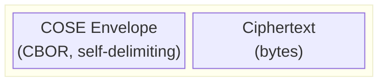
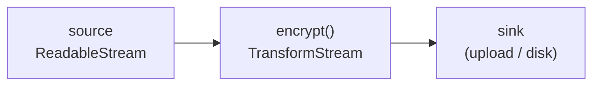

# Filecoin Encryption Envelope — technical specification

Implementation of [FIP #1253](https://github.com/filecoin-project/FIPs/discussions/1253): a COSE
container pairing a self-describing metadata envelope with detached ciphertext.

Status: draft. Nothing is published; the wire profile below is not yet frozen.

## Scope

| Owns | Does not own |
| --- | --- |
| Envelope format, encode and decode | Where the CEK came from |
| Encryption and decryption, both schemes | Key derivation trees, salts, passwords |
| Chunk layout and positional nonce derivation | Datasets, wallets, on-chain state |
| AEAD and AAD construction | Storage, retrieval, HTTP |
| Key wrapping to recipients | Recipient key discovery |
| Authenticated range decryption | Any UX |

The library accepts a 32-byte content encryption key and asks no questions about it. Application
metadata travels inside the envelope as opaque CBOR: we carry it and authenticate it, we never
interpret it.

## Blob layout



CBOR is self-delimiting, so a reader decodes the envelope off the front of the stream and every
remaining byte is ciphertext. No length prefix, no framing. For the chunked scheme the ciphertext
is fixed-stride, which is what makes range reads arithmetic rather than an index lookup:

```
one chunk on the wire = [ ciphertext (chunk_size bytes) ‖ tag (16 bytes) ]

[chunk₀][chunk₁][chunk₂] … [chunkₙ]
                            └─ the only short one:
                               (plaintext_len mod chunk_size) + 16
```

Every chunk occupies exactly `chunk_size + 16` bytes except the last, so chunk `i` begins at
`envelope_len + i × (chunk_size + 16)`.

## Wire profile

We implement the FIP as written, with one deliberate exception (`chunk_count`). Both existing
implementations, the `foc-encryption` TypeScript demo and `go-fee`, share a different profile
inherited from the demo; see [Divergences](#divergences-from-go-fee).

### Protected header

Serialised as a byte string and fed into the AEAD, so every field here is authenticated by every
chunk tag.

| Label | Name | Type | Required | Notes |
| --- | --- | --- | --- | --- |
| 1 | `alg` | int | yes | `3` or `-65793` |
| 16 | `typ` | tstr | yes | `application/vnd.filecoin-encryption+cose` |
| 3 | `content_type` | tstr / uint | no | media type of the plaintext |
| -1 | `chunk_size` | uint | chunked only | plaintext bytes per chunk |
| -65791 | `chunk_count` | uint | no | present when the content length is known, see below |
| -65792 | `app_metadata` | map | no | string-keyed, opaque to this library |

### Unprotected header

Not covered by the AEAD.

| Label | Name | Type | Required | Notes |
| --- | --- | --- | --- | --- |
| 5 | `iv` | bstr | yes | 12 bytes (scheme 1) or 7-byte base nonce (chunked) |

`iv` is the only unprotected field, and it has to be: a decryptor needs it to initialise the AEAD
operation that verifies the protected header, so it cannot itself live inside what that operation
verifies. Tampering with it fails the tag anyway.

### CDDL

```cddl
Filecoin-Encryption-Envelope = COSE_Encrypt0_Tagged / COSE_Encrypt_Tagged

COSE_Encrypt0_Tagged = #6.16([ protected: bstr, unprotected: header_map, ciphertext: nil ])
COSE_Encrypt_Tagged  = #6.96([ protected: bstr, unprotected: header_map, ciphertext: nil,
                               recipients: [+ COSE_recipient] ])

COSE_recipient = [ protected: bstr, unprotected: header_map, ciphertext: bstr ]

protected_header_map = {
  1  => 3 / -65793,                                 ; alg (REQUIRED)
  16 => "application/vnd.filecoin-encryption+cose", ; typ (REQUIRED)
  ?  3 => tstr / uint,                              ; content type of plaintext (OPTIONAL)
  ? -1 => uint,                                     ; chunk_size, REQUIRED for chunked scheme only
  ? -65791 => uint,                                 ; chunk_count, chunked only, when length is known
  ? -65792 => { * tstr => any },                    ; application metadata (OPTIONAL)
}

unprotected_header_map = {
  5 => bstr,                    ; iv (REQUIRED)
}
```

### Algorithms

| ID | Scheme | Seekable |
| --- | --- | --- |
| `3` | AES-256-GCM, single AEAD operation over the whole plaintext | no |
| `-65793` | Chunked AES-256-GCM with STREAM | yes |

Scheme 1 must be selected explicitly. Choosing it forfeits range decryption, so it is never a
default and never inferred.

Recipient key wrapping: `-5` (A256KW) and `-31` (ECDH-ES+A256KW, HKDF-SHA-256 per RFC 9053
§6.3.1). Heterogeneous recipients in one envelope are supported.

### Per-chunk nonce

```
nonce (12) = base_nonce (7) ‖ chunk_index (4, big-endian) ‖ last_flag (1)
last_flag  = 0x01 on the final chunk, 0x00 otherwise
```

Every chunk uses the *same* AAD, the envelope-level `Enc_structure`. The nonce is the only thing
binding a chunk to its position, which is what detects reordering, insertion and truncation.

### AAD

```cddl
Enc_structure = [ context: "Encrypt0" / "Encrypt", protected: bstr, external_aad: bstr ]
```

Context is `"Encrypt"` for tag 96 and `"Encrypt0"` for tag 16, derived from the envelope tag
rather than from recipient presence. `external_aad` is always empty.

### `chunk_count` and truncation

`chunk_count` is the number of chunks in the object. A reader can always work it out for itself, so
storing it adds no information — but stored in the right place it detects a truncated object.

**Chunk layout** means how the ciphertext is divided: how many chunks, how long the last one is, and
the total plaintext size. A reader needs all of it before decrypting anything, because a chunk's
nonce includes the last-chunk flag. Two numbers give you the lot — the blob size and the chunk size.
(`go-fee` calls this the STREAM *geometry*.)

```
ciphertext_size = blob_size − envelope_len
stride          = chunk_size + 16

chunk_count     = ceil(ciphertext_size / stride)
last_chunk_len  = ciphertext_size − (chunk_count − 1) × stride
plaintext_size  = (chunk_count − 1) × chunk_size + (last_chunk_len − 16)
```

So the field is redundant, and that is why the FIP says not to store it. We store it because it
catches truncation. Take an object of 100 chunks where a gateway serves only the first 50:

- **Not stored.** A range read over the first 40 chunks succeeds. Nothing reveals the object is short.
- **Stored, header untouched.** The header says 100, the blob says 50. We reject it.
- **Stored, and the count edited to 50.** Now the placement decides. In the *unprotected* header the
  edit is free and the read succeeds. In the *protected* header the edit changes the AAD, so every
  chunk tag fails.

That third case is the whole argument, so we put it in the protected header at `-65791`. Both
existing implementations keep it unprotected, where the third case defeats it.

We write it whenever the caller supplies `contentLength`. An encoder streaming input of unknown
length cannot know the count in advance and omits it — and because the field is protected, that
absence is itself trustworthy. An attacker cannot strip the count to escape the check, because
removing it changes the AAD and fails every tag.

Objects with no count are still checkable, just not for free. Reading the final chunk does it: if
the object was really longer, the chunk a reader believes is last was sealed with `last_flag = 0x00`
and opening it with `0x01` fails the tag. A one-byte suffix range (`{ offset: -1 }`) forces exactly
that read. The two mechanisms cover each other:

| | Authenticated `chunk_count` | Read the final chunk |
| --- | --- | --- |
| Cost | compare two integers | extra round trip, up to `chunk_size + 16` bytes |
| Needs the length known at encryption | yes | no |
| Works on unknown-length streams | no | yes |

Two consequences. The same plaintext encrypted with and without `contentLength` produces different
*ciphertext*, not just a different envelope, because the protected header feeds the AAD. And it is a
fourth divergence from `go-fee` — one that costs nothing, since `typ` and `chunk_size` already make
the two formats mutually unreadable.

Three rules make the check correct, all of them easy to get wrong:

- **Always derive the layout from the blob size, then compare the declared count against it.** Never
  the reverse. The TypeScript demo trusts the declared count and derives only as a fallback.
- **Write `ceil(plaintext_len / chunk_size)`.** Empty input is `1`: a single empty final chunk
  carrying only its tag.
- **Derive the expected count from the *ciphertext* length, not the plaintext length.** A plaintext
  that is an exact multiple of the chunk size seals validly as either `k` chunks (last one full) or
  `k+1` (last one empty), and both decrypt to the same bytes. Deriving from the plaintext size
  recognises only the first form and rejects the second, which whole-object decryption accepts
  without complaint. We always write the `k` form and accept both. `go-fee` documents this at
  `range.go:290`.

## Divergences from go-fee

`go-fee`'s README names the TypeScript demo, not the FIP, as its source of truth for the wire
format. We follow the FIP instead, so our envelopes and `go-fee`'s are **mutually unreadable**
until it adopts these values.

| Field | Ours (FIP) | go-fee | Effect |
| --- | --- | --- | --- |
| `typ` | `application/vnd.filecoin-encryption+cose` | `application/vnd.foc-envelope+cose` | rejects our envelope outright |
| `chunk_size` | `-1`, protected | `-65790`, unprotected | cannot work out the chunk layout |
| `app_metadata` | `-65792`, protected | not implemented | nothing to lose; must be added either way |
| `chunk_count` | `-65791`, **protected**, authenticated | `-65791`, unprotected, advisory | ours detects deliberate truncation; theirs only accidents |
| Scheme 1 (`alg 3`) | implemented | not implemented | we are a superset |
| All-zero CEK | rejected | not checked | we are stricter; the FIP says MUST |
| Chunk bounds | enforced | enforced | agree |
| Wrap algorithms | `-5`, `-31`, HKDF-SHA-256 | identical | agree, deliberately |

`go-fee` also changed its ECDH-ES derivation from Concat-KDF to RFC 9053 HKDF-SHA-256 after
`v0.1.0`, and **both write `alg -31`** with nothing on the wire to distinguish them. Envelopes from
the two versions do not interoperate.

## Proposed FIP amendments

1. **Per-object CEKs are mandatory for the chunked scheme, not merely recommended — and the stated
   reuse budget is wrong by twenty orders of magnitude.** The security considerations justify key
   reuse with "the birthday bound on 96-bit nonces … approximately 2^48 encryptions". That number
   describes scheme 1's 12-byte random IV. The chunked scheme has no 96-bit nonce:

   ```
   nonce (12 bytes) = base_nonce (7) ‖ chunk_index (4) ‖ last_flag (1)
                      └── random ──┘   └──── deterministic ────┘
   ```

   Only 7 bytes are unpredictable — the index and flag are fixed by position — so the space is 2^56,
   not 2^96. Random values collide at the square root of their space, which puts coin-flip odds near
   2^28 objects and a conservative limit, keeping collision risk below 2⁻³², at roughly **5,800
   objects** under one key.

   A single collision is worse than one nonce reuse. Because the index is deterministic, two objects
   sharing a base nonce produce byte-identical nonces at *every* chunk index: 4,096 keystream reuses
   for a pair of 1 GiB files at the default chunk size. Each one leaks the XOR of the two plaintexts,
   and together they expose GCM's authentication subkey, which enables tag forgery.

   Per-object CEKs remove the risk structurally rather than probabilistically: within a single object
   the chunk counter guarantees distinct nonces, so no two chunks — and no two objects — are ever
   encrypted under one key twice. Two changes follow. Make it MUST for the chunked scheme, and
   correct the analysis: as written it hands an implementer contemplating a dataset-wide key a budget
   of 2^48 when the real figure is a few thousand. A wrong number in a security section is worse than
   no number, because it reassures rather than merely failing to warn.
2. **`typ`** — adopt the shipped string, or state why implementations should change.
3. **`chunk_size`** — either accept the unprotected placement and delete the claim that it "can be
   trusted for offset calculations", which is false where it ships, or coordinate a break.
4. **`chunk_count`** — the FIP says do not store it; both implementations store it unprotected.
   Store it in the *protected* header when the content length is known. Authenticated, it is the
   only thing that detects a deliberately truncated object on a range read that does not reach the
   final chunk; unprotected, an attacker edits it to match and the check is worthless.
5. **Overhead table** — 4096 chunks per GiB at 256 KiB × 16-byte tags is 64 KiB per GiB, not 4 KiB.
   The worked example should read 0.0061%, not 0.0004%.

## API

```ts
// ── encryption ──────────────────────────────────────────────────────────────
function encrypt(options: EncryptOptions): TransformStream<Uint8Array, Uint8Array>

interface EncryptOptions {
  cek: Uint8Array                   // exactly 32 bytes, not all-zero
  scheme?: 'chunked' | 'aes-gcm'    // default 'chunked'
  chunkSize?: number                // 4 KiB … 16 MiB, default 256 KiB
  contentType?: string
  appMetadata?: Record<string, unknown>
  recipients?: Recipient[]          // present ⇒ COSE_Encrypt (tag 96)
  contentLength?: number            // enables the authenticated chunk_count
}

// ── decryption ──────────────────────────────────────────────────────────────
function decrypt(cek: Uint8Array): TransformStream<Uint8Array, Uint8Array>
function decryptWith(unwrapper: Unwrapper): TransformStream<Uint8Array, Uint8Array>

// ── inspection, no key required ─────────────────────────────────────────────
function parse(source: Uint8Array | BlobFetcher): Promise<EnvelopeInfo>

interface EnvelopeInfo {
  scheme: 'chunked' | 'aes-gcm'
  contentType?: string
  appMetadata?: Record<string, unknown>
  recipients: RecipientInfo[]
  params: EnvelopeParams
}

// ── range decryption ────────────────────────────────────────────────────────
function decryptRange(
  source: BlobFetcher | Uint8Array,
  cek: Uint8Array,
  range: ByteRange,
  options?: { params?: EnvelopeParams }
): Promise<RangeResult>

interface ByteRange {
  offset: number      // negative ⇒ suffix, e.g. -1024 is the last 1024 bytes
  length?: number     // omitted ⇒ to end of plaintext
}

interface RangeResult {
  stream: ReadableStream<Uint8Array>
  plaintextLength: number                            // Content-Length
  plaintextSize: number                              // Content-Range total
  ciphertextSpan: { offset: number; length: number } // what will actually be fetched
  includesFinalChunk: boolean                        // truncation detection applies?
}

type BlobFetcher = (start: number, end?: number) => Promise<Uint8Array>

// TODO(v2): multiple ranges in one call (HTTP multipart ranges).

// ── cached envelope parameters ──────────────────────────────────────────────
interface EnvelopeParams {
  headerLength: number     // offset at which ciphertext begins
  baseNonce: Uint8Array
  chunkSize: number
  aad: Uint8Array          // the whole Enc_structure
  toJSON(): unknown        // persistable; fromJSON() to restore
}

// ── standalone key wrapping (no envelope) ───────────────────────────────────
function wrapKey(cek: Uint8Array, recipient: Recipient): Promise<Uint8Array>   // COSE_recipient
function unwrapKey(coseRecipient: Uint8Array, unwrapper: Unwrapper): Promise<Uint8Array>
```

`EnvelopeParams` exists so a store that already keeps metadata beside a blob can serve a range with
one fetch instead of two. Every field is already public at the front of the blob, so caching it
discloses nothing, and the CEK is deliberately not part of it. A stale copy cannot produce wrong
plaintext: `baseNonce` and `aad` are bound into every tag, and `headerLength`/`chunkSize` decide
which bytes are read under which nonce, so drift surfaces as an authentication failure. The AAD is
cached whole rather than rebuilt, because nothing else records which `Enc_structure` context the
envelope used.

`wrapKey` returns a `COSE_recipient` structure rather than raw bytes, so it is self-describing and
can later be spliced into an envelope's recipients array unchanged. It exists because a share made
*after* upload must not touch the envelope — adding a recipient changes the blob, the piece CID,
and forces a re-upload.

## Streaming



Everything is a `TransformStream`. Chunks are emitted as they are produced; no path materialises a
whole object.

**Memory is bounded by chunk size, not by file size.** One correction to the usual O(1) claim:
streaming *encrypt* and whole-object *decrypt* hold **two** chunks, because a chunk's nonce depends
on whether it is the last one, which is unknown until the following read returns. Range decryption
needs no lookahead — layout is derived from the blob size up front — so it holds one. At the
256 KiB default that is 512 KiB and 256 KiB respectively, flat, for any input size.

Runtime requirements: `crypto.subtle`, `crypto.getRandomValues`, `TransformStream`,
`ReadableStream`. No `Buffer`, `fs`, `path`, or `process`; no Node built-ins anywhere. The monorepo
requires Node >= 22; the code itself needs only globals stable since Node 18, and runs unmodified
in browsers.

## Security properties

**Authenticated:** ciphertext, the protected header in full (`alg`, `typ`, `content_type`,
`chunk_size`, `chunk_count`, `app_metadata`), and each chunk's position and finality via its nonce.

**Not authenticated:** `iv`, and nothing else. It fails closed — a tampered IV yields a wrong nonce
and a failed tag, never plausible plaintext.

**Reading `app_metadata` before decryption is unverified.** A dataset-key holder must read the
derivation context out of the header *before* deriving the key that would authenticate it. Putting
the field in the protected header makes tampering detectable *when you decrypt*, not before. A
tampered salt yields a wrong key and a failed tag. No pre-decryption trust decision may rest on it.

**A range read authenticates only the chunks it touches.** Truncation detection lives in the final
chunk's `last_flag`, so a range that stops short of the end cannot detect that the object was cut.
`includesFinalChunk` reports whether it applied. To check deliberately, read the last byte with a
suffix range; if it authenticates, that chunk really was final at encryption time.

An authenticated `chunk_count` closes this gap for free, because a truncated blob either disagrees
with the declared count or has had its protected header edited, which fails every tag. It is present
only when the content length was known at encryption time; for an object streamed from an input of
unknown length, the one-byte suffix read above is the remedy. STREAM binds an object's *end*, never
its length, so one of the two is always required — a truncated prefix is otherwise indistinguishable
from a genuinely shorter object.

**The caller must not reuse a CEK across objects.** See amendment 1 — the chunked scheme has 56
bits of nonce randomness. This is a constraint on the key handed to us, not a statement about how
keys should be produced.

**Metadata is public.** Algorithm, parameters, content type, application metadata and the number
and type of recipients are all readable without any key.

## Limits

| | |
| --- | --- |
| CEK | exactly 32 bytes, all-zero rejected |
| Chunk size | 4 KiB … 16 MiB, default 256 KiB |
| Chunk count | 2³² − 1, so ~1 PiB of plaintext at the default chunk size |
| Envelope | 1 MiB decode ceiling, so a malformed prefix cannot force a large allocation |
| Streaming memory | 2 × chunk size (encrypt, whole-object decrypt), 1 × (range) |

## Open questions

- npm package name and import path. "Filecoin Encryption Envelope" is the library's name;
  `@filoz/filecoin-encryption-envelope` is long and `@filoz/fee` collides with payments vocabulary.
- Whether to add a second decode profile for `go-fee`-format blobs. Deferred until such blobs exist;
  `typ` is a clean discriminator, so it can be added without disturbing anything.
- Cross-implementation test vectors. Out of scope for now, and blocked on `go-fee` adopting the FIP
  profile regardless.
